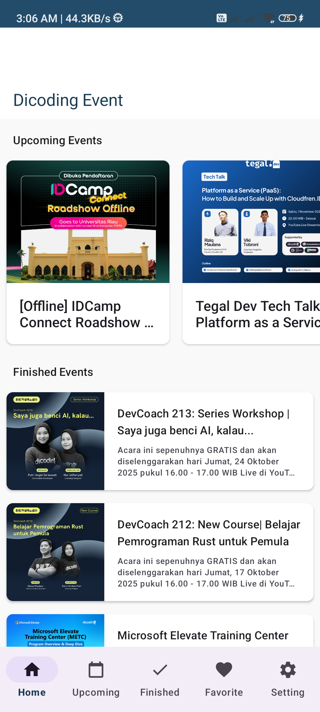
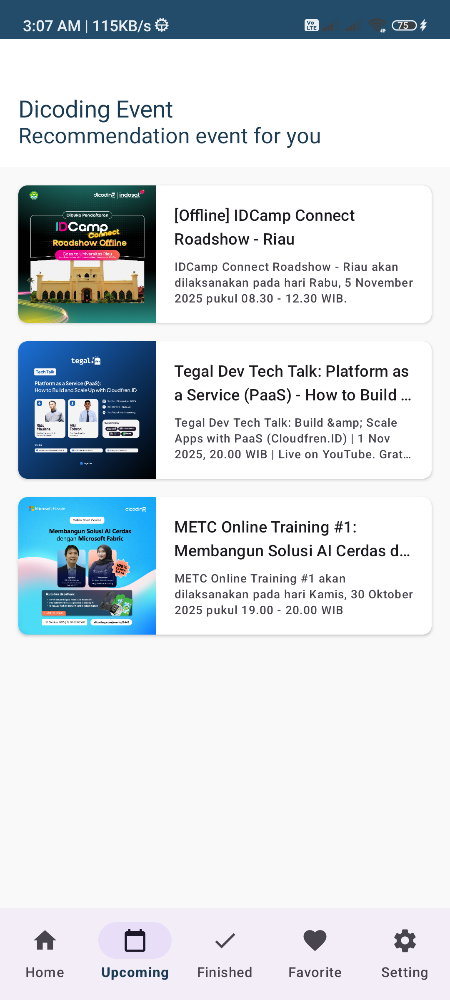
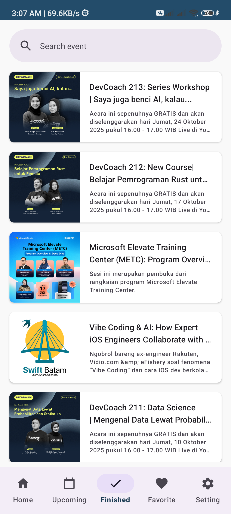
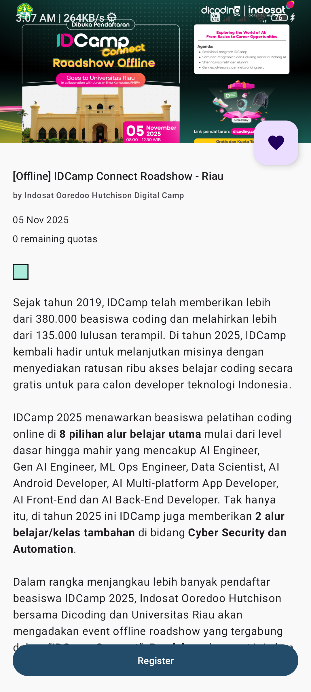
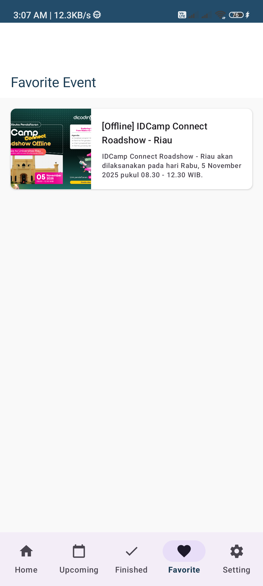
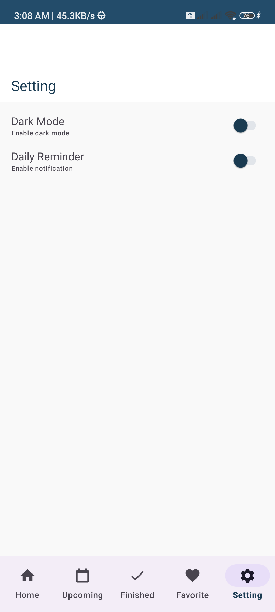

# Dicoding Event

Dicoding Event adalah aplikasi Android sederhana yang menampilkan daftar event (acara) yang akan datang dan yang telah selesai dari Dicoding. Pengguna dapat melihat detail event, mencari event, dan menambahkannya ke daftar favorit.

## Fitur Utama

* **Jelajahi Event:** Menampilkan daftar event yang akan datang dan yang telah selesai.
* **Detail Event:** Menampilkan informasi rinci tentang event, termasuk deskripsi, waktu, kuota, dan penyelenggara.
* **Pencarian:** Memungkinkan pengguna mencari event tertentu (diimplementasikan di tab 'Finished').
* **Favorit:** Pengguna dapat menyimpan event ke daftar favorit untuk akses mudah. Fitur ini didukung oleh database lokal (Room).
* **Mode Gelap (Dark Mode):** Mendukung tema terang dan gelap yang dapat diatur melalui halaman pengaturan. Pengaturan tema disimpan menggunakan DataStore.
* **Pengingat Harian:** Fitur (opsional) untuk mendapatkan notifikasi harian tentang event menggunakan WorkManager.

## Teknologi yang Digunakan

* **Bahasa:** [Kotlin](https://kotlinlang.org/)
* **Arsitektur:** Model-View-ViewModel (MVVM)
* **UI:**
    * Material Design 3
    * ViewBinding
    * RecyclerView
    * [Android Navigation Component](https://developer.android.com/guide/navigation)
* **Networking:**
    * [Retrofit 2](https://square.github.io/retrofit/) - Untuk konsumsi REST API.
    * [OkHttp 3](https://square.github.io/okhttp/) - Untuk logging interceptor.
* **Asinkron:**
    * [Kotlin Coroutines](https://kotlinlang.org/docs/coroutines-overview.html) & [Flow](https://kotlinlang.org/docs/flow.html)
    * [LiveData](https://developer.android.com/topic/libraries/architecture/livedata)
* **Persistensi Data:**
    * [Room](https://developer.android.com/training/data-storage/room) - Untuk menyimpan data favorit secara lokal.
    * [DataStore](https://developer.android.com/topic/libraries/architecture/datastore) - Untuk menyimpan pengaturan pengguna (tema & pengingat).
* **Background Processing:**
    * [WorkManager](https://developer.android.com/topic/libraries/architecture/workmanager) - Untuk menjadwalkan pengingat harian.
* **Image Loading:**
    * [Glide](https://github.com/bumptech/glide)
* **Dependency Injection:**
    * Manual DI (menggunakan Factory Pattern)

## Prasyarat Instalasi

Untuk membangun dan menjalankan proyek ini, Anda memerlukan:
1.  Android Studio (versi stabil terbaru direkomendasikan).
2.  JDK 21 (sesuai konfigurasi `build.gradle.kts`).
3.  Min SDK 24.
4.  Koneksi internet untuk mengambil data event dari API.

## Screenshot

| Upcoming | Finished |
| :---: | :---: |
|  |  |

| Detail Event | Favorit |
| :---: | :---: |
|  |  |

| Setting |
| :---: |
|  |
